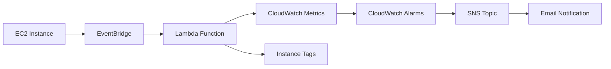

# EC2 Global Instance Limit Monitor

[](https://aws.amazon.com/lambda/)
[](https://www.python.org/)
[](LICENSE)

A serverless monitoring system that automatically tracks EC2 instance counts and sends alerts when the global limit is exceeded.

## 🚀 Features

- **Real-time Monitoring**: Event-driven architecture with instant notifications
- **Global Instance Tracking**: Monitors all running EC2 instances across the account
- **Multi-layer Alerting**: Instance tagging + CloudWatch metrics + Email notifications
- **Cost Effective**: Uses AWS native services with minimal cost (<$10/month)
- **Non-disruptive**: Tags violating instances without terminating them

## 🏗️ Architecture



## 📋 Prerequisites

- AWS CLI configured with appropriate permissions
- Python 3.9+
- IAM permissions for EC2, Lambda, CloudWatch, SNS, and EventBridge

## 🛠️ Installation

### 1. Create IAM Role

```bash
aws iam create-role \
  --role-name EC2MonitorRole \
  --assume-role-policy-document file://trust-policy.json

aws iam put-role-policy \
  --role-name EC2MonitorRole \
  --policy-name EC2MonitorPolicy \
  --policy-document file://permissions-policy.json
```

### 2. Deploy Lambda Function

```bash
# Package the function
zip lambda_function.zip lambda_function.py

# Create the function
aws lambda create-function \
  --function-name ec2-instance-monitor \
  --runtime python3.9 \
  --role arn:aws:iam::ACCOUNT:role/EC2MonitorRole \
  --handler lambda_function.lambda_handler \
  --zip-file fileb://lambda_function.zip \
  --description "Monitor EC2 instance count and send alerts when limit exceeded"
```

### 3. Create EventBridge Rule

```bash
aws events put-rule \
  --name EC2-Instance-Monitor-Rule \
  --event-pattern file://event-pattern.json \
  --description "Trigger Lambda when EC2 instances enter running state"

aws events put-targets \
  --rule EC2-Instance-Monitor-Rule \
  --targets "Id"="1","Arn"="arn:aws:lambda:REGION:ACCOUNT:function:ec2-instance-monitor"
```

### 4. Setup SNS Notifications

```bash
# Create SNS topic
aws sns create-topic --name EC2-Instance-Limit-Alerts

# Subscribe email
aws sns subscribe \
  --topic-arn arn:aws:sns:REGION:ACCOUNT:EC2-Instance-Limit-Alerts \
  --protocol email \
  --notification-endpoint your-email@domain.com
```

### 5. Create CloudWatch Alarms

```bash
# Violation status alarm
aws cloudwatch put-metric-alarm \
  --alarm-name EC2-Instance-Limit-Violation \
  --alarm-description "Alert when EC2 instances exceed global limit" \
  --metric-name ViolationStatus \
  --namespace EC2/GlobalMonitoring \
  --statistic Sum \
  --period 300 \
  --threshold 1 \
  --comparison-operator GreaterThanOrEqualToThreshold \
  --evaluation-periods 1 \
  --alarm-actions arn:aws:sns:REGION:ACCOUNT:EC2-Instance-Limit-Alerts

# Total count alarm
aws cloudwatch put-metric-alarm \
  --alarm-name EC2-Total-Instance-Count-Exceeded \
  --alarm-description "Alert when total EC2 instances exceed 12" \
  --metric-name TotalInstanceCount \
  --namespace EC2/GlobalMonitoring \
  --statistic Maximum \
  --period 300 \
  --threshold 12 \
  --comparison-operator GreaterThanThreshold \
  --evaluation-periods 1 \
  --alarm-actions arn:aws:sns:REGION:ACCOUNT:EC2-Instance-Limit-Alerts
```

## 📁 Project Structure

```
├── README.md
├── lambda_function.py          # Main Lambda function code
├── trust-policy.json          # IAM trust policy
├── permissions-policy.json    # IAM permissions policy
├── event-pattern.json         # EventBridge event pattern
├── deployment/
│   ├── deploy.sh              # Deployment script
│   └── cleanup.sh             # Cleanup script
└── docs/
    ├── architecture.md        # Detailed architecture
    └── troubleshooting.md     # Troubleshooting guide
```

## ⚙️ Configuration

### Instance Limit

Modify the limit in `lambda_function.py`:

```python
# Check global limit (12 instances total)
if existing_count >= 12:  # Change this value
```

### Email Notifications

Update SNS subscription:

```bash
aws sns subscribe \
  --topic-arn arn:aws:sns:REGION:ACCOUNT:EC2-Instance-Limit-Alerts \
  --protocol email \
  --notification-endpoint new-email@domain.com
```

## 📊 Monitoring

### CloudWatch Metrics

- **Namespace**: `EC2/GlobalMonitoring`
- **Metrics**:
  - `ViolationStatus`: Indicates when limit is exceeded (0/1)
  - `TotalInstanceCount`: Current number of running instances

### Instance Tags

Violating instances are tagged with:
- `ViolationReason`: "Exceeded global instance limit"
- `GlobalLimit`: "12"
- `ViolationTime`: Unique violation timestamp

### Logs

Lambda execution logs: `/aws/lambda/ec2-instance-monitor`

## 🔍 Usage Examples

### Check Violating Instances

```bash
aws ec2 describe-instances \
  --filters "Name=tag:ViolationReason,Values=*" \
  --query 'Reservations[*].Instances[*].[InstanceId,Tags[?Key==`Name`].Value|[0]]'
```

### View Metrics

```bash
aws cloudwatch get-metric-statistics \
  --namespace EC2/GlobalMonitoring \
  --metric-name TotalInstanceCount \
  --start-time 2024-01-01T00:00:00Z \
  --end-time 2024-01-02T00:00:00Z \
  --period 3600 \
  --statistics Maximum
```

### Test the System

```bash
# Launch a test instance
aws ec2 run-instances \
  --image-id ami-0abcdef1234567890 \
  --instance-type t3.micro \
  --tag-specifications 'ResourceType=instance,Tags=[{Key=Name,Value=Test-Instance}]'
```

## 🚨 Troubleshooting

### Common Issues

1. **Lambda not triggered**
   - Check EventBridge rule configuration
   - Verify Lambda permissions

2. **No email notifications**
   - Confirm SNS subscription status
   - Check spam folder

3. **Tags not applied**
   - Verify EC2 permissions in IAM role
   - Check Lambda execution logs

### Debug Commands

```bash
# Check Lambda logs
aws logs describe-log-streams \
  --log-group-name /aws/lambda/ec2-instance-monitor

# View CloudWatch alarms
aws cloudwatch describe-alarms \
  --alarm-names EC2-Instance-Limit-Violation

# Check SNS subscriptions
aws sns list-subscriptions-by-topic \
  --topic-arn arn:aws:sns:REGION:ACCOUNT:EC2-Instance-Limit-Alerts
```

## 💰 Cost Estimation

| Service | Monthly Cost |
|---------|-------------|
| Lambda | ~$0.20 |
| CloudWatch | ~$3.00 |
| SNS | ~$0.50 |
| EventBridge | ~$1.00 |
| **Total** | **~$5.00** |

*Based on typical usage patterns*

## 🔒 Security Considerations

- IAM roles follow least privilege principle
- No hardcoded credentials in code
- SNS topics use encryption in transit
- CloudWatch logs retention configured

## 🤝 Contributing

1. Fork the repository
2. Create a feature branch (`git checkout -b feature/amazing-feature`)
3. Commit your changes (`git commit -m 'Add amazing feature'`)
4. Push to the branch (`git push origin feature/amazing-feature`)
5. Open a Pull Request

## 📝 License

This project is licensed under the MIT License - see the [LICENSE](LICENSE) file for details.

## 🙋‍♂️ Support

- Create an [Issue](https://github.com/username/ec2-instance-monitor/issues) for bug reports
- Start a [Discussion](https://github.com/username/ec2-instance-monitor/discussions) for questions
- Check [Wiki](https://github.com/username/ec2-instance-monitor/wiki) for detailed documentation

## 📈 Roadmap

- [ ] Multi-region support
- [ ] Slack/Teams integration
- [ ] Instance type-specific limits
- [ ] Auto-termination option
- [ ] Cost budget integration
- [ ] Terraform deployment option

---

**⭐ If this project helped you, please give it a star!**
